# Artist's Cafe - Introduction

**Artist's Cafe** is developed using Django Framework:

> The Artist's Cafe's online platform allows people to order and pay online in-store. There is also a delivery option in case the cafe wishes to allow local customers to order deliveries to their address. There is an admin panel which allows the owner/manager or members of staff to manage stock and check orders and income. Staff members will have restricted views and permissions.

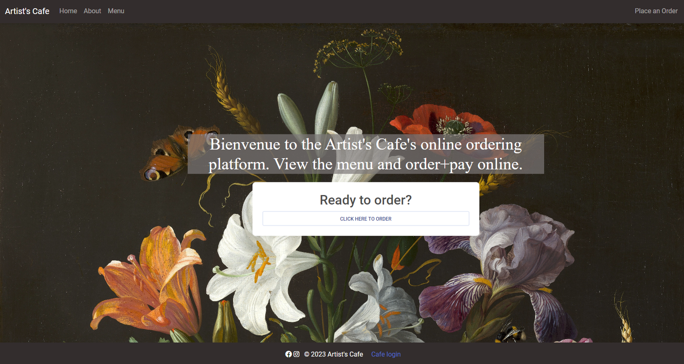
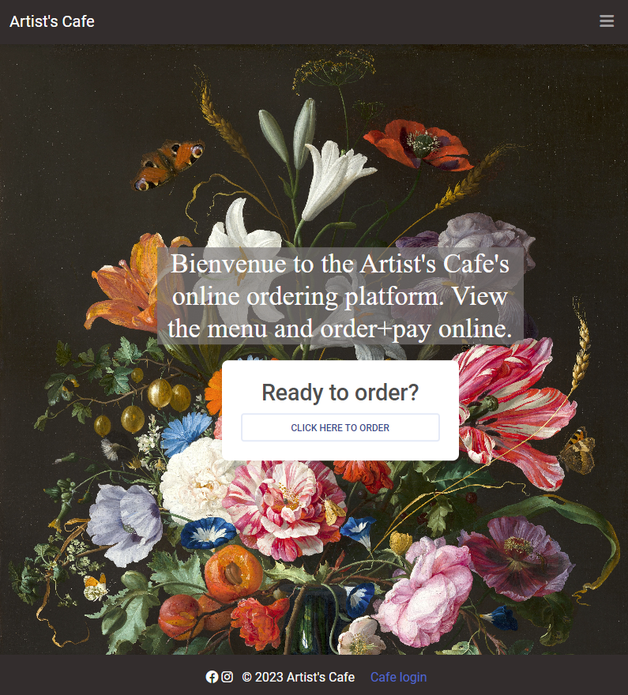

-----

# User Experience - UX

## Site Aims

* Artist's Cafe is a website that allows the cafe's customers to order online while in-store, with the possible option for locals to order food to be delivered to their address (if the cafe has the capability).
* The site aims to provide user with a visually pleasing and easily navigatable interface that is straight to the point.
* This website provides the user with the ability to order food and pay for it.
* The website has an admin dashboard that allows users (the owner, managers and staff) to manage orders and see if something has been paid for.
* Users will have different levels of permissions depending on their job and responsibilites.

## Agile Methodology

The Agile Methodology was used to plan this project: 

* To Do- (All the User stories were initially entered in the 'To Do' column)
* In Progress- (then during development story they were moved into the 'In Progress' column)
* Done- (they get moved into 'Done' once the development completes)
* Testing- (and then finally making sure you continiously test the features of the app to make sure everythin works and is user friendly)

Viola le Trello Board: 
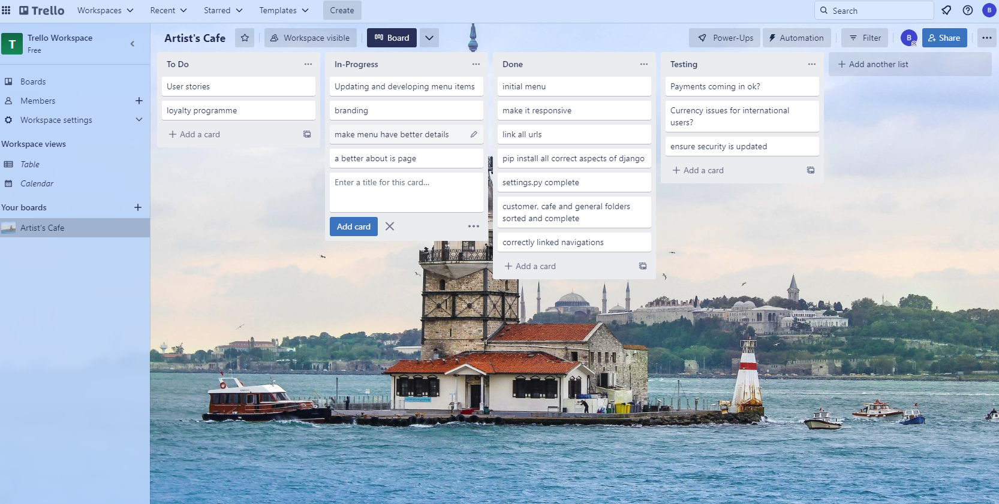

## User Stories
 Five User Stories were created:

#### User Stories:

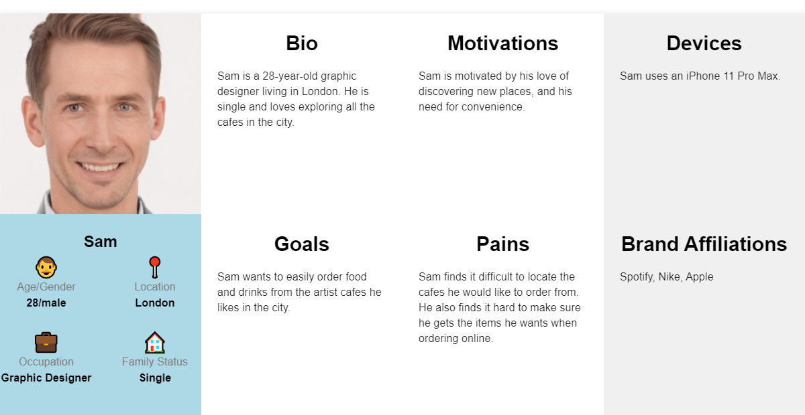
Person One
* As a site user, Sam can use a search bar to search for a specific place so that he has quick and easy access to the information he needs.
.png)
Person Two
* Ethan wants to browse the menu to buy something reasonably priced.
.png)
Person Three
* As an artist, Mike wants an artsy cafe to hang out in, and thus he loves the Artist's Cafe. For him, it's all about building an image of himself and his lifestyle.
.png)
Person Four
* Lauren can share the website on her social media - she can share the about page and then integrate that into TikTok.
.png)
Person Five
* Olivia prefers to order online because she has anxiety. The app helps her minimise human contact.

**Before Project Inception**

- Design ERD and Data 
- Create Repository in GitHub
- Create Project, Epics, User Stories and prepare Trello Board

**Creation of Project in GitPod**

- Create Database Models
	- Set up models.py file
- Build Admin site
- Set up Templates
	- Create base.html - Navbar and Footer content, which gets extended to all the other template files
	- Add responsiveness to navigation and footer
    - Create index.html, view and style
	- Set up template file features with views.py and urls.py
  - about.html (Description about Artist's Cafe)
- Install Allauth for sign in, sign up and sign out templates with-  pip3 install django-allauth 
	- Install crispy-forms to add styles to Django account templates with-  pip3 install crispy-bootstrap5

-----

[Back to top](#content)

## Design

### Colours

The colour scheme is an attempt to keep on-brand for the cafe, while making sure the website is useable and accessible.

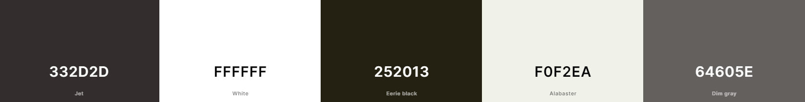

### Typography

Fonts were imported using Google Fonts. American Typewriter was used throughout with a backup of serif. It was chosen for easy readability for users.

### Imagery

All the imagery is related to the brand of the cafe or menu items.

### Wireframes

The wireframe is as followed:

- This is the homepage, where people can go onto different sections of the site, such as if they want to order or find out more about the cafe or see the menu items.

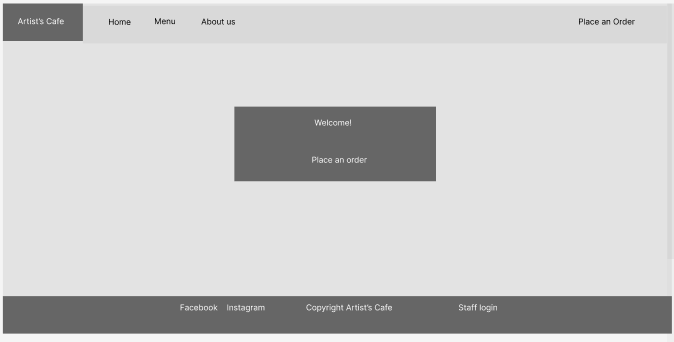

- This is the about page.

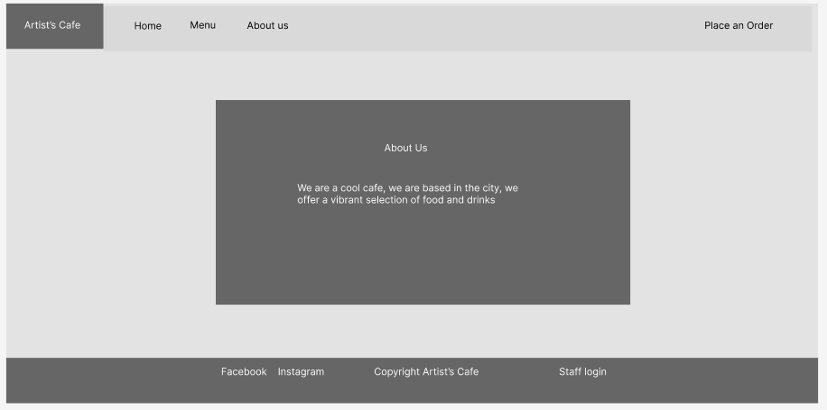

- This is the page where the menu is, just for browsing the menu items.

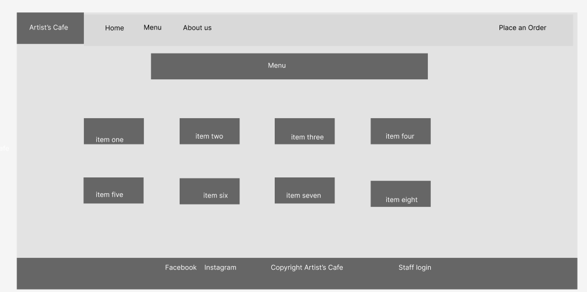

- This is the order page, you can both browse and order items.

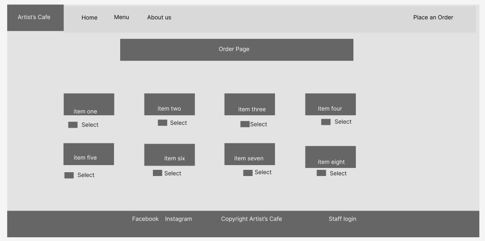

- Once people order from the page, they will be prompted to pay. They can see a summary of the items they want to make sure they've selected what they want and to see how much it costs.

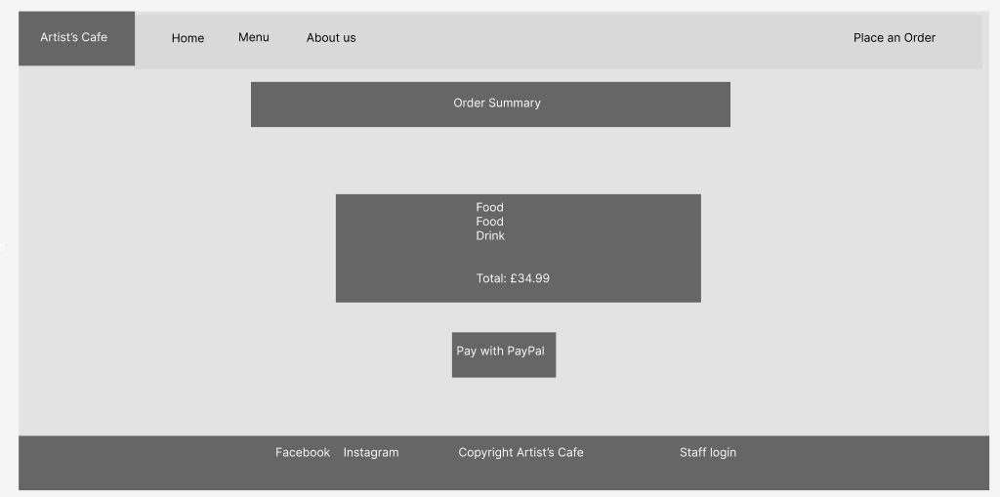

- If they decide to pay, they'll pay and a pay will open to confirm it has been successful.

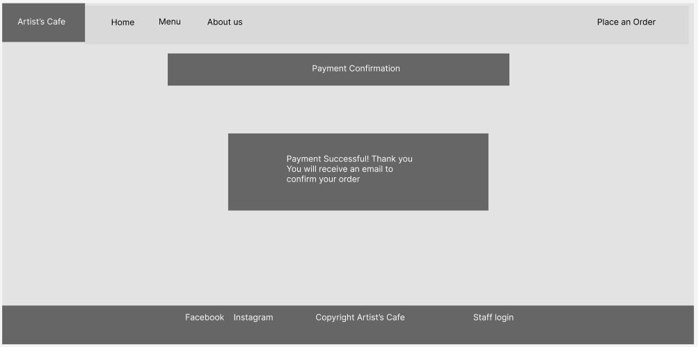

[Back to top ⇧](#content)

----

# Features

## Home Page

This is a spring to whatevr users want, whether they want to see the menu, order, find out about the cafe, or if the staff members want to log into the dashboard.

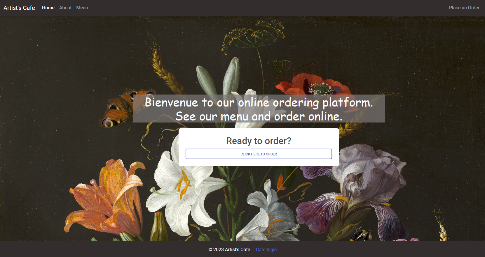

----

## Navbar

- The navigation bar is present at the top of every page and navigates all links to the respective pages.
- The navbar is fully responsive, collapsing into a hamburger menu when the screen size becomes smaller.

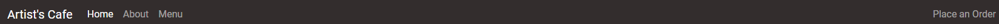

----

## Footer

- On the website footer, users can see basic information such as my social media, copyright, and a login for staff members.

----

## About Page

- The About Page gives, users information about the Artist's Cafe.

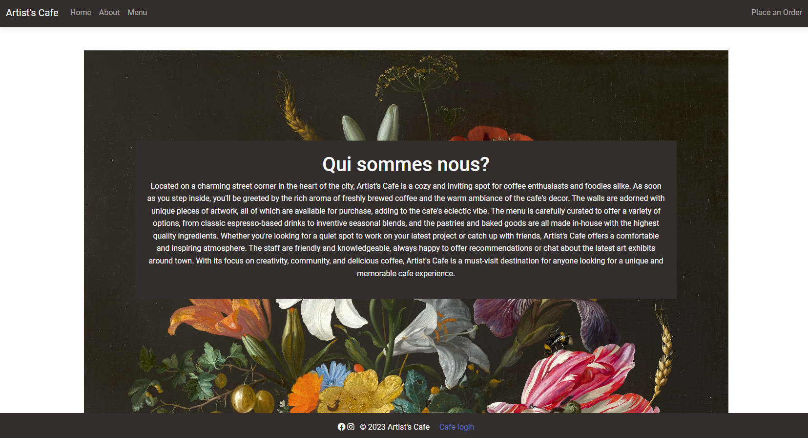

----

## Menu Page

This page showcases what is on the menu.

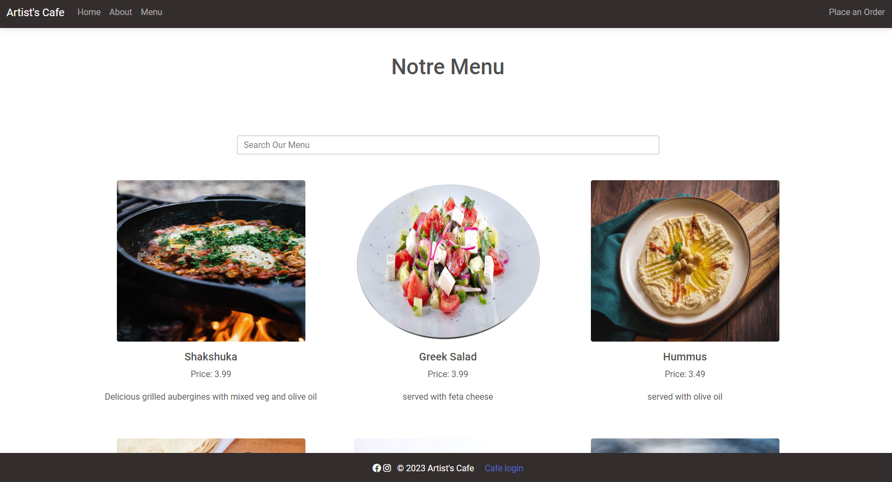

----

## Order Page

- When a user clicks place order, they come to this page where they can select what they want:

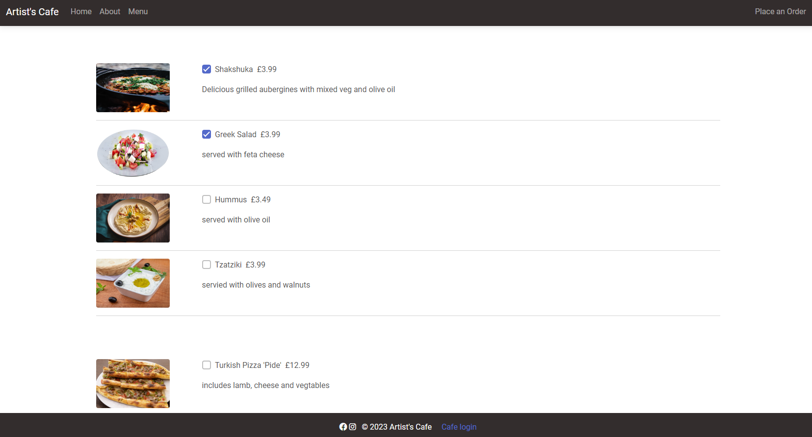

- After they choose what they want they'll have to give their personal details. 

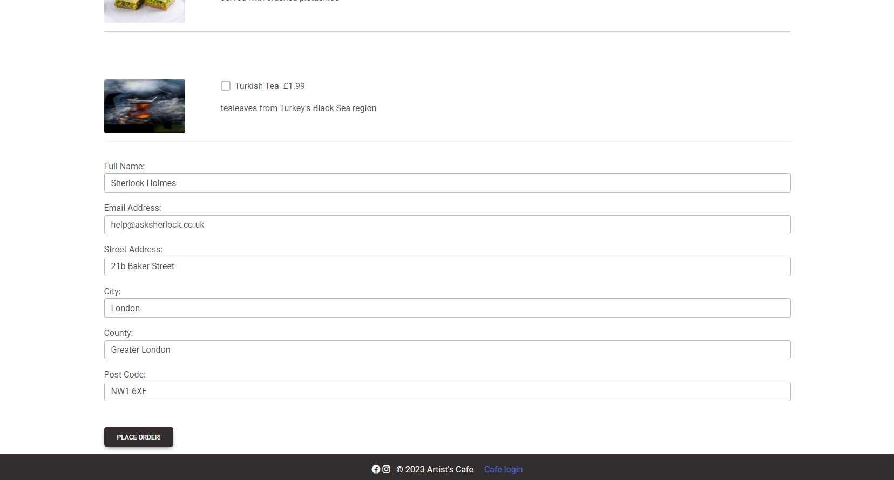

- They can then pay via PayPal.

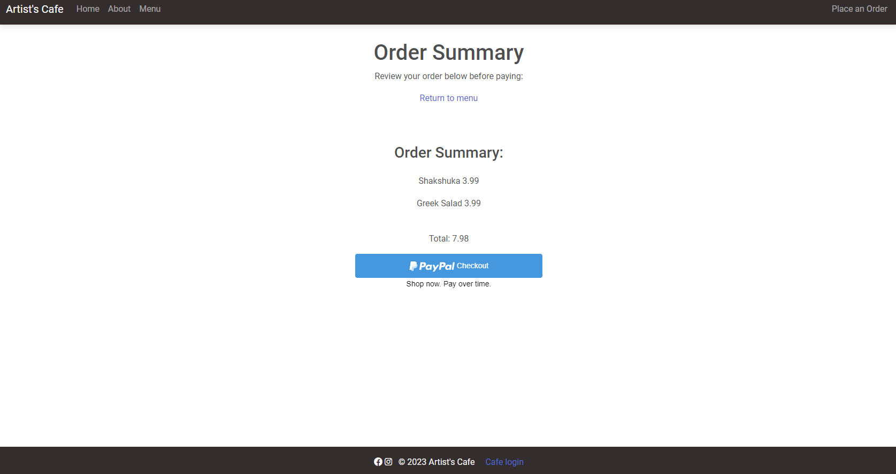

- Once they've paid it'll confirm payment.

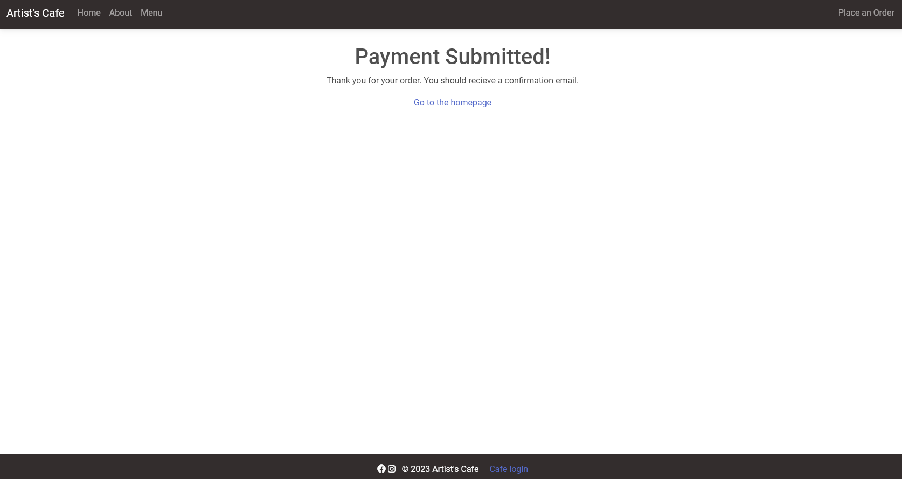

----

## Sign In Page

If staff members want to log into the staff dashboard to check orders, they'll first have to sign in.

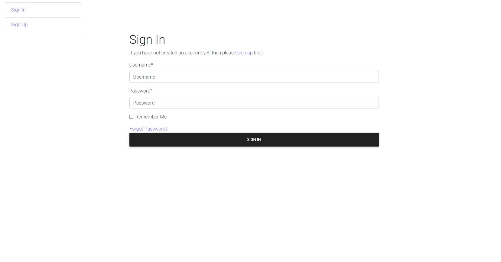

----

## Sign Up Page

- Sign Up is closed by default.

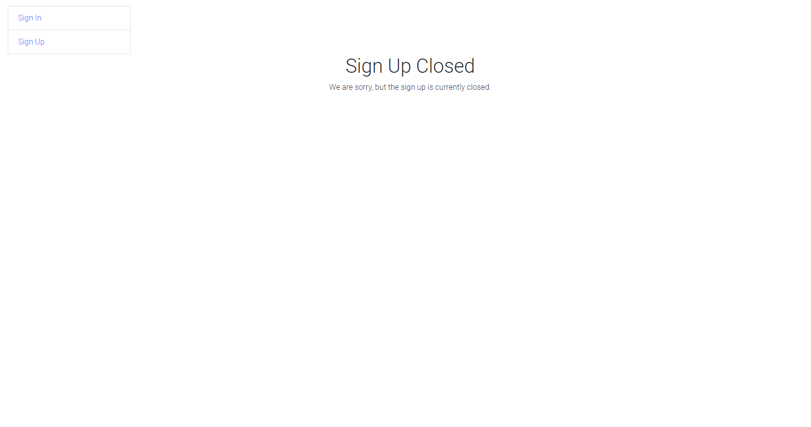

----

## Dashboard
Once signed in staff members can check orders.

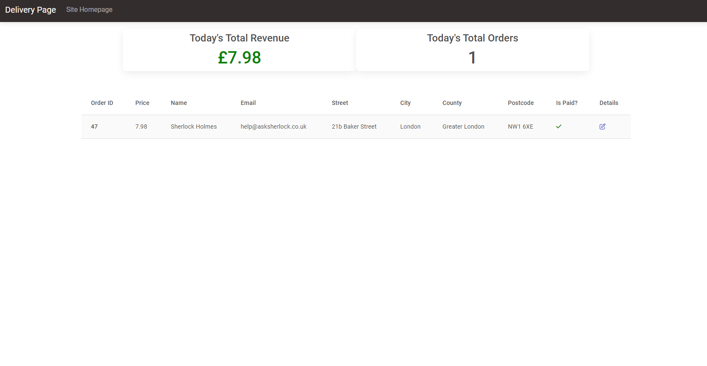

----

## Admin Panel/Superuser
The admin will have access to the admin page:

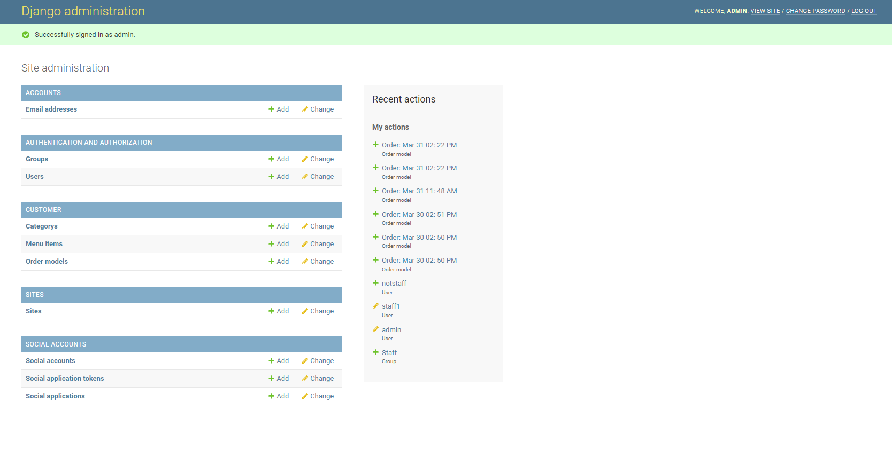

- Admin accesses the project via logging into Django admin panel with a superuser id and password. 
- A superuser "admin" was created for this project to manage the admin panel.

----

## Technologies Used

### Languages Used

* [HTML 5](https://en.wikipedia.org/wiki/HTML/)- Used to structure all the templates on the site
* [CSS 3](https://en.wikipedia.org/wiki/CSS)- to provide extra styling to the site
* [JavaScript](https://www.javascript.com/)- Minimum javascript was used to fade out alerts after a few seconds.
* [Python](https://www.python.org/)- To provide the functionality to the site. Packages used in the project can be found in requirements.txt

### Django Packages

* [Allauth](https://django-allauth.readthedocs.io/en/latest/installation.html)- For authentication, registration, account management.
* [Crispy Forms](https://django-crispy-forms.readthedocs.io/en/latest/)- To style the forms.

### Frameworks - Libraries - Programs Used

* [Django](https://www.djangoproject.com/) was used as the framework for the back-end logic of the project. Django enables rapid and secure development.
* [Bootstrap](https://getbootstrap.com/)- Used to style the website, add responsiveness and interactivity.
* [Git](https://git-scm.com/)- Used for version control by utilizing the Gitpod terminal to commit to Git and push to GitHub.
* [GitHub](https://github.com/)- Used to store the project's code after being pushed from Git.
* [Google Chrome Developer Tools](https://developers.google.com/web/tools/chrome-devtools) was used to inspect page elements, debug, troubleshoot and test features and adjust property values.
* [Font Awesome:](https://fontawesome.com/) was used to add icons for aesthetic and UX purposes.

-----

[Back to top ⇧](#content)

## Testing

### Validation
I used the following validation tools to validate HTML, CSS, PYTHON codes. Below the link of TESTING.md file, which includes all validation results.  
- HTML using [W3C HTML validator](https://validator.w3.org/)
- CSS using [Jigsaw CSS validator](https://jigsaw.w3.org/css-validator/)
- Python via [PEP8 CI Python Linter](https://pep8ci.herokuapp.com/)

### Manual Testing
Testing has taken place continuously throughout the development of the project. Each view was tested regularly. When the outcome was not as expected, debugging took place at that point. An exhaustive list of features were checked on different devices and browsers. They were performed and their scrrenshots can be found in the features section on how the distinct features render. All clickable links redirect to the correct pages.

Incidentally, the scenario testing has been shown in the initial set of screens shown at the beginning of the document.

----

## Bugs

| **Bug** | **Fix** |
| ----------- | ----------- |
| Templates for the style of the dashboard wasn't working.| Added templates in two separate areas |

| **Unfix Bug** |
| ----------- | 
| Templates are in two locations - if I remove either it stops working. Ideally there should just be one. |

----

## Future Implementation

* Deploy the website

[Back to top ⇧](#content)

## Learning Resources
- Code Institutes Full Stack Framework Module
- Youtube videos by [Legion Script](https://www.youtube.com/@LegionScript)
- [W3CSchool](https://www.w3schools.com/django/)
- [Django Documentation](https://docs.djangoproject.com/en/3.2/ref/models/fields/#field-types)(For different quaries while doing project. For example query about models, fields, form widgets, auth and many more)
- Other open source to understand and solve following types of error : UnboundedLocalError, MultivalueDictKeyError,  ProgrammingError, InvalidCursorName etc.

## Content and Media

Images are taken from [Unsplash](https://www.unsplash.com/).

----

## Acknowledgement

Special thanks to my mentor Richard Malhotra, my fellow classmates, and family for their assistance throughout this project.

[Back to top](<#content>)
   